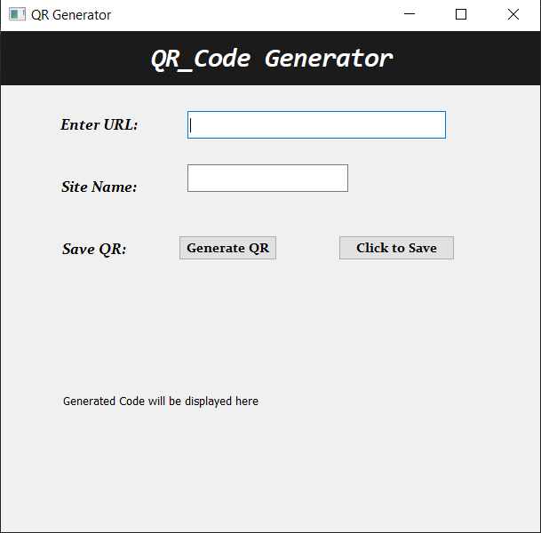
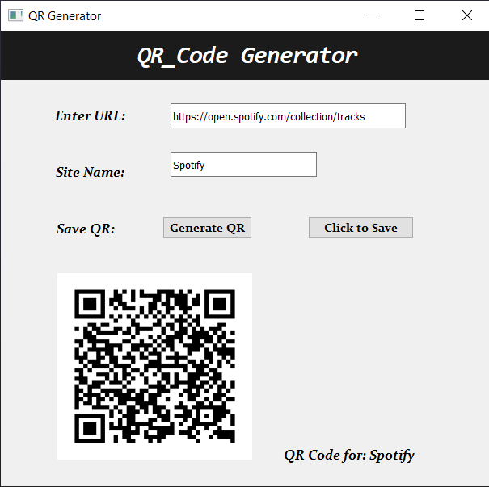
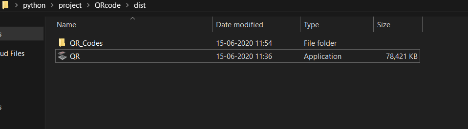

# QR-Code-Generator 
> A simple python based application to generate QR codes, and share them instead of copying and pasting links!!!

## How it works❓

 - Download the 1st release from the link provided below.
 - Store the application at your desired location.
 - Run the applicaion and provide the details to generate the QR code.
 - Once generated click on **Save** to save the QR code.
 - The QR code is saved in a new folder named **QR codes** for later usage purpose.
 
 > Download the first release here: 
 
 ## GUI 🙌
 
  - Run the application.
  
  
  
  - Enter details and generate the QR
   
  
  
  - A new folder is created and QR is saved.
  
  
  
  
